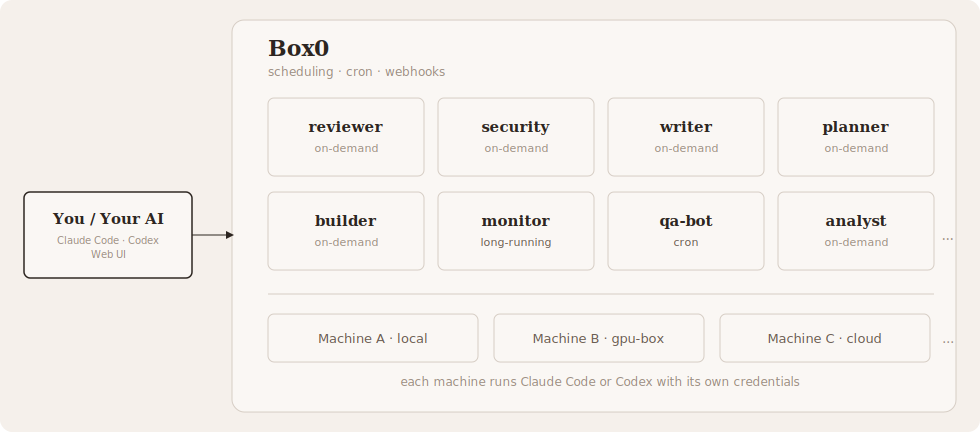

# Box0: Open-Source Multi-Agent Platform

[](https://www.npmjs.com/package/@box0/cli)
[](LICENSE)
[](https://github.com/risingwavelabs/box0/tree/main/docs)
[](https://box0.dev/skill.md)

Box0 runs multiple AI agents in parallel across your machines. You create agents with different roles, delegate tasks to them, and collect results. It works with Claude Code and Codex. Single Rust binary, no dependencies.

<p align="center">
  
</p>

## How it works

A **server** coordinates everything. It stores agent definitions, routes tasks, runs the scheduler, and serves a web dashboard. Start one with `b0 server`.

**Machines** are computers that run agents. When the server starts, it registers itself as the `local` machine. Add more with `b0 machine join`. Each machine uses its own Claude Code or Codex credentials. Machines belong to the server and are shared across all workspaces.

**Workspaces** organize agents by team. Each user gets a personal workspace. Create shared ones with `b0 workspace create` and invite members. Agents in a workspace are visible to all its members.

**Agents** do the actual work. Each agent has a name, a set of instructions, and runs on a specific machine. There are three kinds:

- **background** - persistent agents that stay around and handle tasks on demand. Created with `b0 agent add`.
- **cron** - run on a schedule. Created with `b0 cron add --every 6h "..."`.
- **temp** - one-off tasks that clean up after themselves. Created with `b0 agent temp "..."`.

Your AI (Claude Code or Codex) delegates work with `b0 delegate`, waits for results with `b0 wait`, and can run multiple agents in parallel. You type one prompt. Your agent handles the rest.

## Agent onboarding

```
Read https://box0.dev/skill.md and follow the instructions to install and configure Box0
```

Your agent sends tasks to the Box0 server via `b0 delegate`. The server stores them in an inbox. A node daemon polls the inbox, spawns a separate Claude Code (or Codex) process for each worker, and writes the results back. Your agent calls `b0 wait` to collect the responses.

Each worker runs in its own isolated directory. Workers can also run across multiple machines. See [Multi-machine](docs/multi-machine.md).

Agent runs use a 30 minute default execution timeout. This prevents longer workflow steps from failing at the old 5 minute default on first run.
## Getting started

Install:

```bash
curl -sSL https://box0.dev/install.sh | sh
```

Or via npm:

```bash
npm install -g @box0/cli@latest
```

Start the server:

```bash
b0 server
```

On first start, Box0 creates an admin account and prints your API key.

### Frontend development

The server now prefers `frontend/dist` when it exists, and falls back to the legacy `web/` dashboard otherwise.

For day-to-day frontend development, run Vite separately:

```bash
cd frontend
pnpm install
pnpm dev
```

Vite proxies `/workspaces`, `/machines`, and `/users` to `http://127.0.0.1:8080` by default. To point it at a different backend, set `B0_FRONTEND_BACKEND_URL`.

To let the Rust server serve the Vue app directly, build the frontend first:

```bash
cd frontend
pnpm build
```

### 3. Teach your agent to use Box0

For Claude Code:
Teach your agent to use Box0 ([how skills work](docs/skills.md)):

```bash
b0 skill install claude-code
b0 skill install codex
```

Then open Claude Code or Codex and say:

> Create three agents: an optimist, a pessimist, and a realist. Ask them to debate whether AI will replace software engineers in 5 years. Give me your own conclusion.

## Features

**Parallel delegation.** Send tasks to multiple agents at once, collect results when they are done.

```bash
b0 delegate reviewer "Review this PR for correctness."
b0 delegate security "Review this PR for vulnerabilities."
b0 wait --all
```

**Cron jobs.** Schedule recurring tasks.

```bash
b0 cron add --every 6h "Check production logs for errors and summarize."
```

**Webhooks and Slack.** Get notified when agents finish.

```bash
b0 agent add monitor --instructions "Watch for regressions." --webhook https://example.com/hook
b0 agent add alerter --instructions "Triage alerts." --slack "#ops"
```

See [Slack setup](docs/slack.md) for configuration.

**Multi-turn conversations.** Continue where you left off.

```bash
THREAD=$(b0 delegate researcher "Compare Postgres and MySQL for our use case.")
b0 wait
b0 delegate --thread $THREAD researcher "Now factor in DynamoDB."
```

**Pipe content.** Pass files and diffs directly.

```bash
git diff | b0 delegate reviewer "Review this diff."
b0 delegate analyst "Summarize this codebase. @src/"
```

**Temp agents.** One-off tasks, no setup.

```bash
b0 agent temp "List the top 5 differences between Rust and Go."
```

**Multi-machine.** Distribute agents across machines. Each machine uses its own credentials.

```bash
b0 machine join http://server:8080 --name gpu-box --key <key>
b0 agent add ml-agent --instructions "ML specialist." --machine gpu-box
```

**Web dashboard.** Manage agents, view tasks, and monitor machines at `http://localhost:8080`.

## CLI reference

```
b0 server                                    Start server
b0 login <url> --key <key>                   Connect from another machine
b0 status                                    Show connection info
b0 invite <name>                             Create user (admin only)
```

```
b0 agent add <name> --instructions "..."     Create agent
b0 agent ls                                  List agents
b0 agent info <name>                         View agent details
b0 agent logs <name>                         View recent task history
b0 agent stop <name>                         Deactivate agent
b0 agent start <name>                        Reactivate agent
b0 agent remove <name>                       Delete agent
b0 agent temp "<task>"                       One-off task (auto-cleanup)
```

```
b0 delegate <agent> "<task>"                 Send task (non-blocking)
b0 delegate --thread <id> <agent> "<msg>"    Continue conversation
b0 wait [--all] [--timeout <sec>]            Collect results
b0 reply <thread-id> "<answer>"              Answer agent question
b0 threads                                   List recent conversations
```

```
b0 cron add --every <interval> "<task>"      Schedule recurring task
b0 cron ls                                   List scheduled tasks
b0 cron remove <id>                          Delete scheduled task
```

```
b0 machine join <url> --name <id>            Join as remote machine
b0 machine ls                                List machines
```

```
b0 workspace create <name>                   Create workspace
b0 workspace add-member <ws> <user-id>       Add member
b0 skill install claude-code                 Install skill for Claude Code
b0 skill install codex                       Install skill for Codex
```

## Learn more

- [Skills](docs/skills.md) - how skills teach your agent to use Box0
- [Multi-machine setup](docs/multi-machine.md) - distribute agents across machines
- [Cron jobs](docs/cron.md) - schedule recurring tasks
- [Slack notifications](docs/slack.md) - get notified when agents finish
- [Workspaces](docs/teams.md) - share a Box0 server with multiple users
- [Architecture](docs/architecture.md) - task flow, data model, and diagrams
- [CLI reference](docs/cli.md) - full command reference
- [Workflows](docs/workflows.md) - agent-first DAG workflow design for Box0

## Web dashboard

Open your browser to the server URL (default `http://localhost:8080`) and log in with your API key. Manage workers, view tasks, monitor nodes, and manage your team from the UI.

## License

MIT License. Copyright (c) 2026 RisingWave Labs.
